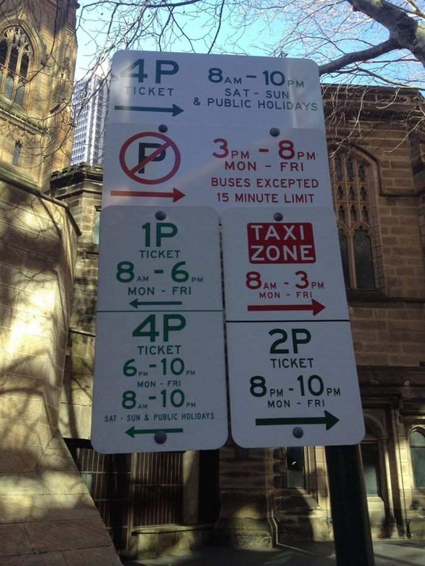

# Lab 5: Parking Ifficer

In this lab, you will learn how to:
- use conditionals
- use logical operators
- use string searching methods

## Question 1: training.cpp

You are training to become a parking officer. Since we are in the age of digital automation, your last task is to convert parking signs to conditionals. Nervous about the upcoming examination, you decide to practice writing some conditions by yourself.

### Program requirements

Modify the following code in `training.cpp`. Do not make changes to any other parts of the code.

1. Find the comment that says "TODO: Step 1". The line of code after it says `if (true) {`. 
Replace the `true` on that line with an expression that is true if x is 10 and y is 5 and false otherwise.
1. Find the comment that says "TODO: Step 2". 
Replace the `true` on the next line of code with an expression that is true if x is a number between 5 and 15 and false otherwise. (It should be true when x is 5 or 15.)
1. Find the comment that says "TODO: Step 3".
Replace the `true` on the next line of code with an expression that is true if y is not divisible by 3 or if y is divisible by 5. (Hint: y is divisible by a number if the leftover of dividing y by that number is 0)
1. Find the comment that says "TODO: Step 4".
Replace the `true` on the next line of code with an expression that is true if `x + y` is not between 10 and 20. (If x + y is 10 or 20, it should be false).
1. Find the comment that says "TODO: Step 5".
Replace the `true` on the next line of code with an expression that is true if exactly one of x and y is negative. The expression should be false if both are positive or both are negative.

## Question 2: parking.cpp

It's the day of the examination. You slept through your alarms and ended up arriving last. The only parking sign left to be converted is [this](http://tripchronicle.blogspot.com/2015/08/parking-out-in-cairns-springboard-to.html).



### What is this sign even saying?

The sign has the following rules:

* If you turn right and it is between 8am and 10pm on Saturday, Sunday, or a holiday, you can park using a 4P ticket.
* If you turn right, if it is between 8am and 8pm from Monday to Friday, you are not allowed to park at all. (Only buses and taxis are allowed and let's assume that you don't drive either of those)
* If you turn right, if it is between 8pm and 10pm from Monday to Friday, you can park using a 2P ticket.
* If you turn left, if it is between 8am and 6pm from Monday to Friday, you can park using a 1P ticket.
* If you turn left, if it is between 6pm and 10pm from Monday to Friday, or if it is between 8am and 10pm on Saturday, Sunday, or a holiday, you can park using a 4P ticket.
* These rules don't cover all the possible times and days. If a day and time combination is not mentioned on the sign, you can park and you don't need a ticket.

### Times

To simplify things a bit for this lab, you can assume the following things:

* The time will always be an hour without any minutes after it.
* The time will be a number between 0 and 23. 0 means midnight, 1-11 means 1am-11am, 12 means noon, and 13-23 means 1pm-11pm.
* If a rule applies to a range of times from X to Y, it applies to all hours starting from X time until (but not including) Y time.
For example, if the rule applies to times between 8pm and 10pm, it applies to 8pm and 9pm. It doesn't apply to 10pm.

### Program requirements

You will be writing a program that prints out one of the following things based on the rules of the sign:

* `"1P"` followed by a newline
* `"2P"` followed by a newline
* `"4P"` followed by a newline
* `"No parking allowed"` followed by a newline
* `"No ticket needed"` followed by a newline

Do the following steps:

1. Read through the starter code to understand what it does.
1. Assign the variable `is_weekend` a value so that it's true if the value of `s` is `"yes"` and false if it's `"no"`.
    * If `s` has any other value, print out `"Invalid input"` + newline, then return with an exit code of `1`.
1. Draw a flowchart that represents the rules of the sign. Your flowchart should be making decisions based on whether it's a weekend/holiday, the direction (left or right), and what hour it is.
    * Similar to the above, if at any point there's an unexpected input (eg. `"LEft"` for `direction`, `26` for `hour`), print out `"Invalid input"` + newline, then return with an exit code of `1`.
1. Write code based on your flowchart to print the output as described above then return `0`.

**Note**: You can create your own flowchart using https://docs.google.com/drawings/ or any other method you prefer. You will need to submit either a `.png` or a Google Drawings link to `Lab 5 - Written` on Gradescope.

### Example expected output

If the user types in yes, left, and 18 (where 18 means 6 pm) your terminal should look like this:
```
$ ./a.out
Is today a weekend or holiday? (yes/no)
yes
What direction are you turning? (left/right)
left
What hour is it? (0-23)
18
4P
$
```
(The exit code should be 0)

If the user types in no, right, and 9 (where 9 means 9am) your terminal should look like this:
```
$ ./a.out
Is today a weekend or holiday? (yes/no)
no
What direction are you turning? (left/right)
right
What hour is it? (0-23)
9
No parking allowed
$
```
(The exit code should be 0)

If the user types in invalid input, your terminal should look like this:
```
$ ./a.out
Is today a weekend or holiday? (yes/no)
n0pe
What direction are you turning? (left/right)
right
What hour is it? (0-23)
9
Invalid input
$
```
(The exit code should be 1)

## Question 3: ticket.cpp

Surprisingly, you got the job! Merely the audacity to tackle that parking sign got you through. However, it's only been a week and you've already given out over a hundred parking tickets, all of which have been contested. Since you're aiming for that "Employee of the Month" award, you decide to write a program to help you filter out the contested tickets.

### Program requirements

Do the following in `ticket.cpp`:

1. Read through the starter code to understand what it does.
1. Find the ticket number from the user input.
    * It can be anywhere in the line that the user types in.
    * It has to be preceded by `ticket#`.
    * It can have any length, as long as it's all digits.
1. Print out the first ticket number + newline if at least one is found, then return 0.
1. If no ticket number is found, print out "Invalid" + newline, then return 1.

### Hints

Refer to the string manipulation methods we learned previously.

Here are some techniques you may want to use:

To get a substring starting from some word until the end:
```c++
string full_text = "hello welcome to intro to programming!";
int intro_idx = full_text.find("intro");
if (intro_idx == string::npos) {
  // we did not find the word "intro"
  ...
} else {
  int substr_len = full_text.length() - intro_idx;
  string intro_text = full_text.substr(intro_idx, substr_len);
  // will print out "intro to programming!"
  cout << intro_text << endl;
}
```

To get the number at the beginning of a string:
```c++
string full_text = "1984 september 2";
// try to find the first non digit character
int idx = full_text.find_first_not_of("0123456789");
if (idx == string::npos) {
  // everything is a digit - the whole string is a number
  ...
} else {
  string num_string = full_text.substr(0, idx);
  // will print out "1984"
  cout << num_string << endl;
}
```

### Example expected output

Expected output for input: `I turned right on a Saturday, that should be allowed. This is for ticket#383 btw.`
```
$ ./a.out
Why are you contesting?
I turned right on a Saturday, that should be allowed. This is for ticket#383 btw.
383
$
```
(The exit code should be 0)

Expected output for input: `ticket#9 im poor ticket#129022 pls help` (We only need to get the first ticket number)
```
$ ./a.out
Why are you contesting?
ticket#9 im poor ticket#129022 pls help
9
$
```
(The exit code should be 0)

Expected output for input: `I shouldn't be charged for Ticket#18111, I didn't do anything wrong.` (notice the `Ticket#` instead of `ticket#` - capitalization matters!)
```
$ ./a.out
Why are you contesting?
I shouldn't be charged for Ticket#18111, I didn't do anything wrong.
Invalid
$
```
(The exit code should be 1)

Expected output for input: `I parked in the designated zone at 2pm on a holiday. I shouldn't be fined for ticket#`
```
$ ./a.out
Why are you contesting?
I parked in the designated zone at 2pm on a holiday. I shouldn't be fined for ticket#
Invalid
$
```
(The exit code should be 1)

## Rubric

* (60 points) Programming
    * (15 points) `training.cpp`
      * (1 point) Code compiles
      * (1 point) TODO comment check
      * (3 points) Style check
      * (10 points) Test cases
    * (30 points) `parking.cpp`
      * (1 point) Code compiles
      * (1 point) TODO comment check
      * (3 points) Style check
      * (25 points) Test cases
    * (15 points) `ticket.cpp`
      * (1 point) Code compiles
      * (1 point) TODO comment check
      * (3 points) Style check
      * (10 points) Test cases
* (40 points) Written assignment - see Gradescope for point breakdowns
    * (5 points) `parking.cpp` flowchart
